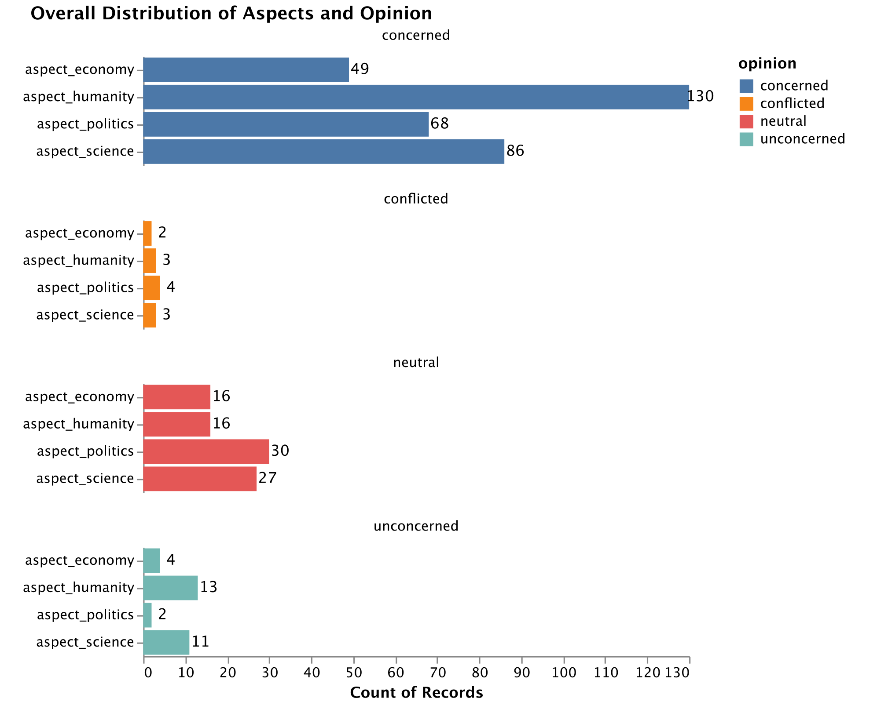
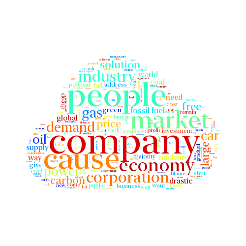
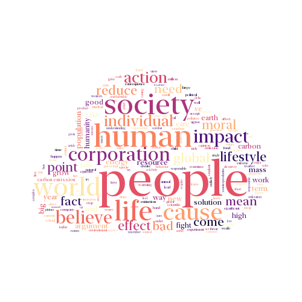
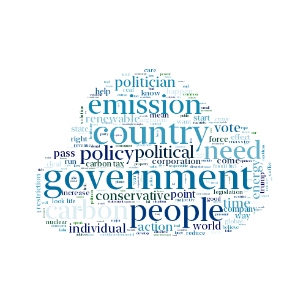
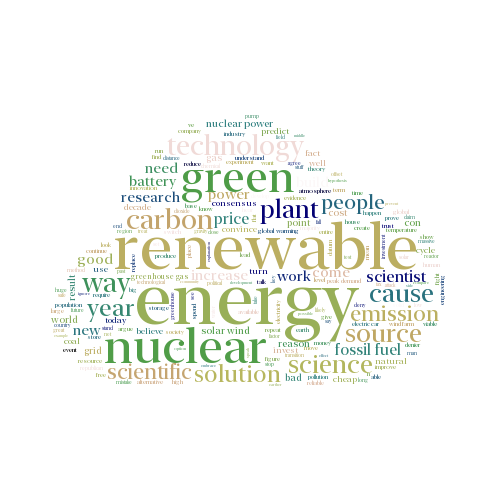
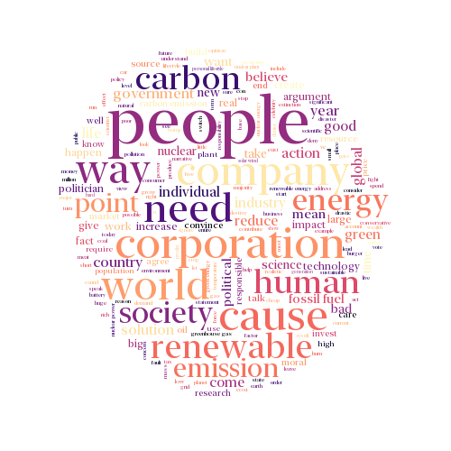
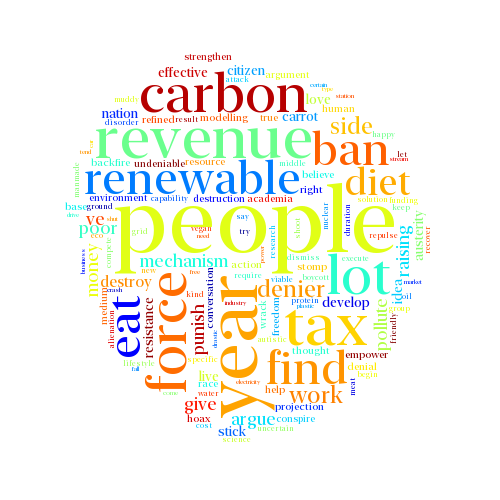
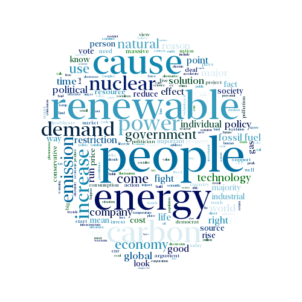
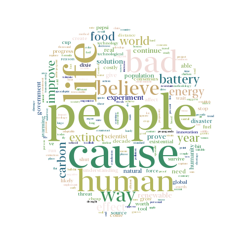

# Visualization of Annotations

# Aspect-specific keywords

<H3>Economy</H3>

<H3>Humanity</H3>

<H3>Politics</H3>

<H3>Science</H3>

# Opinion-specific keywords

<H3>Concerned</H3>

<H3>Conflicted</H3>

<H3>Neutral</H3>

<H3>Unconcerned</H3>

