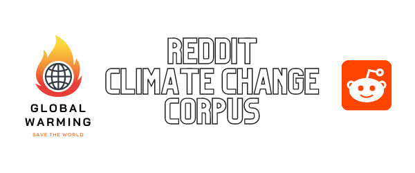

This is a subset of [the larger corpus](https://github.com/toshikoshibano/persuasion_corpus). From the larger corpus, we extracted discourses about climate change, annotated for aspects (politics, economy, science, humanity) and opinions (concerned, conflicted, neutral, unconcerned). For detailed annotation guidelines, click [here](../annotation_guidelines.md).

# Corpus Statistics
117 delta threads over 79 sub-topics (4,524 sentences; 98,164 words)

# Tf-Idf Results
## Top 10 trigrams
1. climate change denier
2. fight climate change
3. combat climate change
4. nuclear power plant
5. climate change denial
6. believe climate change
7. deny climate change
8. stop climate change
9. greenhouse gas emission
10. green house gas

## Top 10 bigrams
1. climate change
2. fossil fuel
3. global warming
4. change denier
5. carbon emission
6. renewable energy
7. electric car
8. greenhouse gas
9. nuclear energy
10. carbon tax

## Top 10 unigrams
1. climate
2. people
3. think
4. like
5. delta
6. point
7. thing
8. need
9. world
10. energy

## Some interesting keywords that are ranked below 10
'mass extinction', 'go extinct', 'existential threat', 'future generation', 'take action', 'human civilization'
